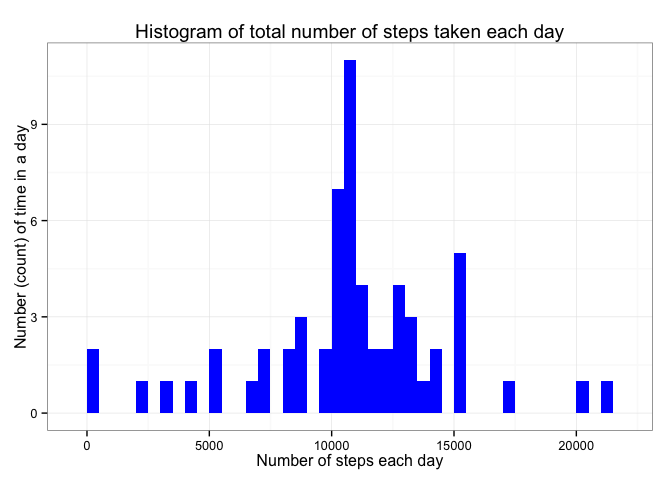

# Assignment 1 Reproducible Research

###Preparation for assignment:

```r
library(knitr)
library(ggplot2)
library(plyr)
library(data.table)
library(lattice)
```

###Set necessary defaults:

```r
opts_chunk$set(echo = TRUE)
```

###Loading and preprocessing the data
Download the [data from here](https://d396qusza40orc.cloudfront.net/repdata%2Fdata%2Factivity.zip), unzip necessary file into your working directory. 

```r
if(!file.exists('activity.csv')){
    unzip('activity.zip')
}
data <- read.csv("activity.csv", header=TRUE, sep=',')
```

Preprocessing
Review data and format - convert date format using lubridate

```r
str(data)
```

```
## 'data.frame':	17568 obs. of  3 variables:
##  $ steps   : int  NA NA NA NA NA NA NA NA NA NA ...
##  $ date    : Factor w/ 61 levels "2012-10-01","2012-10-02",..: 1 1 1 1 1 1 1 1 1 1 ...
##  $ interval: int  0 5 10 15 20 25 30 35 40 45 ...
```

```r
head(data)
```

```
##   steps       date interval
## 1    NA 2012-10-01        0
## 2    NA 2012-10-01        5
## 3    NA 2012-10-01       10
## 4    NA 2012-10-01       15
## 5    NA 2012-10-01       20
## 6    NA 2012-10-01       25
```

### Calculate the total number of steps taken per day

```r
totalsteps <- aggregate(steps ~ date, data, sum)
```

### Make a histogram of the total number of steps taken each day

```r
ggplot(totalsteps, aes(x = steps)) +
        geom_histogram(fill = "red", binwidth = 500) +
        labs(title="Histogram of total number of steps taken each day", 
             x = "Number of steps each day", y = "Number (count) of time in a day") + theme_bw()
```

 


### Calculate and report the mean and median of the total number of steps taken per day

```r
stepsperdayMean <- mean(totalsteps$steps, na.rm=TRUE)
stepsperdayMedian <- median(totalsteps$steps, na.rm=TRUE)
```
The mean is 1.0766189\times 10^{4} and the median is 10765.

## What is the average daily activity pattern?

Make a time series plot (i.e. type = "l") of the 5-minute interval (x-axis) and the average number of steps taken, averaged across all days (y-axis)  


```r
averages <- aggregate(x=list(steps=data$steps), by=list(interval=data$interval),
                      FUN=mean, na.rm=TRUE)
ggplot(data=averages, aes(x=interval, y=steps)) +
    geom_line() +
    xlab("5-minute interval") +
    ylab("average number of steps taken")
```

 


Which 5-minute interval, on average across all the days in the dataset, contains the maximum number of steps?

```r
maxsteps <- averages[which.max(averages$steps),]
```
The max interval and steps result 835, 206.1698113. The most active 5-minute interval is between 8:35 a.m. and 8:40 a.m. with an average of about 206 steps.  

### Imputing missing values
Calculate and report the total number of missing values in the dataset

```r
missingvalues <- sum(is.na(data$steps))
```

The total missing number of values in the data set is 2304.

Devise a strategy for filling in all of the missing values in the dataset. The strategy does not need to be sophisticated. For example, you could use the mean/median for that day, or the mean for that 5-minute interval, etc.  

Strategy: create a new dataset using the mean values of its 5-minute interval and verify that there are no missing values.  


```r
nomissingdata <- function(data, pervalue) {
        naset <- which(is.na(data$steps))
        nafill <- unlist(lapply(naset, FUN=function(idx){
                interval = data[idx,]$interval
                pervalue[pervalue$interval == interval,]$steps
        }))
        stepsfill <- data$steps
        stepsfill[naset] <- nafill
        stepsfill
}
nonasdata <-data.frame(
        steps = nomissingdata(data, averages),
        date = data$date,
        interval = data$interval)
str(nonasdata)
```

```
## 'data.frame':	17568 obs. of  3 variables:
##  $ steps   : num  1.717 0.3396 0.1321 0.1509 0.0755 ...
##  $ date    : Factor w/ 61 levels "2012-10-01","2012-10-02",..: 1 1 1 1 1 1 1 1 1 1 ...
##  $ interval: int  0 5 10 15 20 25 30 35 40 45 ...
```

```r
anynas <- sum(is.na(nonasdata))
```
The number of missing data in the new data set is 0.  

### Make a histogram of the total number of steps taken each day with the new dataset (nonasdata)  


```r
totalnonassteps <- aggregate(steps ~ date, nonasdata, sum)
ggplot(totalnonassteps, aes(x = steps)) +
        geom_histogram(fill = "blue", binwidth = 500) +
        labs(title="Histogram of total number of steps taken each day", 
             x = "Number of steps each day", y = "Number (count) of time in a day") + theme_bw()
```

 


Calculate and report the mean and median total number of steps taken per day  

```r
totalnonassteps <- tapply(nonasdata$steps, nonasdata$date, FUN=sum)
stepsnonasMean <- mean(totalnonassteps)
stepsnonasMedian <- median(totalnonassteps)
```
The mean with no NA values is 1.0766189\times 10^{4} and the median is 1.0766189\times 10^{4}.     

What is the impact of imputing missing data on the estimates of the total daily number of steps?    

There is a minimial difference between this new result and the previous result, there was a variation between the mean and median previously: The prior mean is 1.0766189\times 10^{4} and the median is 10765.  


### Are there differences in activity patterns between weekdays and weekends?  

Create a new factor variable in the dataset with two levels – “weekday” and “weekend” indicating whether a given date is a weekday or weekend day.  


```r
dataweekday <- nonasdata

weekend <- weekdays(as.Date(dataweekday$date)) %in% c("Saturday", "Sunday")

dataweekday$daytype <- "weekday"
dataweekday$daytype[weekend == TRUE] <- "weekend"

dataweekday$daytype <-as.factor(dataweekday$daytype)

str(dataweekday)
```

```
## 'data.frame':	17568 obs. of  4 variables:
##  $ steps   : num  1.717 0.3396 0.1321 0.1509 0.0755 ...
##  $ date    : Factor w/ 61 levels "2012-10-01","2012-10-02",..: 1 1 1 1 1 1 1 1 1 1 ...
##  $ interval: int  0 5 10 15 20 25 30 35 40 45 ...
##  $ daytype : Factor w/ 2 levels "weekday","weekend": 1 1 1 1 1 1 1 1 1 1 ...
```

```r
head(dataweekday)
```

```
##       steps       date interval daytype
## 1 1.7169811 2012-10-01        0 weekday
## 2 0.3396226 2012-10-01        5 weekday
## 3 0.1320755 2012-10-01       10 weekday
## 4 0.1509434 2012-10-01       15 weekday
## 5 0.0754717 2012-10-01       20 weekday
## 6 2.0943396 2012-10-01       25 weekday
```

### Make a panel plot containing a time series plot (i.e. type = "l") of the 5-minute interval (x-axis) and the average number of steps taken, averaged across all weekday days or weekend days (y-axis).  


```r
weekdayinterval <- aggregate(steps ~ interval + daytype, dataweekday, mean)
names(weekdayinterval)[3] <- "stepsmean"
xyplot (stepsmean ~ interval | daytype,
        weekdayinterval,
        type = "l",
        layout = c(1,2),
        main = "Time series plot of the 5-minute interval",
        xlab = "5-minute interval",
        ylab = "Average number of steps taken \n broken out by weekend or weekday")
```

 


Yes, there is a difference in activity patterns between weekend and weekdays. The weekend does not peak as high, nor does the activity start as early in the day, but has a higher activity average throughout the intervals. 
